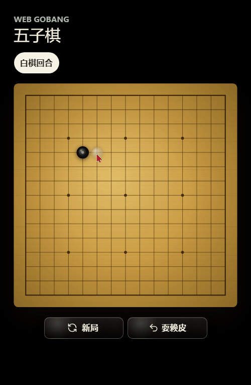

# Web Gobang

一个移动端优先的网页五子棋项目，支持本地对弈和房间联机。

## 演示



## 功能

- 本地/联机 15x15 经典五子棋。
- 支持房间邀请码和邀请链接加入。
- 联机入口：点击左上角“五子棋”logo 区域。
- 支持悔棋、认输、新局和胜负判断。
- PWA manifest、Service Worker 应用壳缓存和本地棋局持久化。
- 带有棋盘动效和音效。

## 本地开发

```bash
pnpm install
pnpm dev
```

## 验证

```bash
pnpm lint
pnpm typecheck
pnpm test
pnpm build
```
